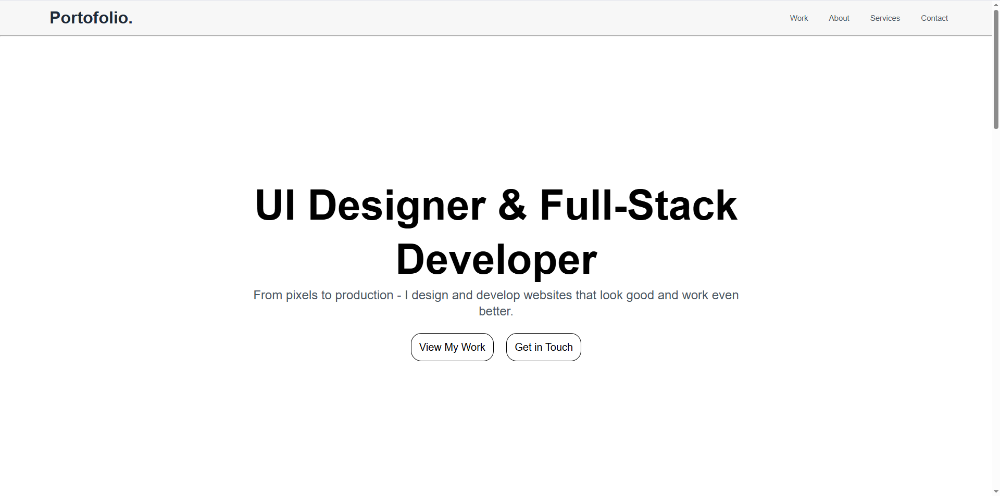

# Website Portofolio

Sebuah website portofolio pribadi yang menampilkan karya, layanan, dan latar belakang saya sebagai UI Designer & Full-Stack Developer. Proyek ini berfungsi sebagai ruang digital untuk mendemonstrasikan kemampuan saya dalam desain web, front-end, dan back-end. Situs ini responsif, dioptimalkan untuk tampilan mobile dan desktop, serta memuat bagian-bagian penting untuk mempresentasikan karya, menawarkan layanan, dan melakukan kontak.

---

## Daftar Isi

- [Fitur](#fitur)  
- [Teknologi yang Digunakan](#teknologi-yang-digunakan)  
- [Struktur Proyek](#struktur-proyek)  
- [Tangkapan Layar](#tangkapan-layar)  
- [Informasi Kontak](#informasi-kontak)  
- [Kontribusi](#kontribusi)  
- [Lisensi](#lisensi)  
- [Tautan Sosial](#tautan-sosial)  
- [Ucapan Terima Kasih](#ucapan-terima-kasih)  

---

## Fitur

- **Navigasi**: Bar navigasi sederhana dan intuitif untuk mengakses bagian Work, About, Services, dan Contact.  
- **Desain Responsif**: Tata letak yang menyesuaikan berbagai ukuran layar, memberikan pengalaman optimal di desktop maupun mobile.  
- **Proyek Unggulan**: Menampilkan beberapa karya saya dengan deskripsi dan gambar, termasuk desain dashboard, aplikasi e‑commerce, dan website portofolio ini.  
- **Form Kontak Interaktif**: Form yang memungkinkan pengunjung mengirim pesan langsung untuk memudahkan komunikasi klien.  
- **Integrasi Media Sosial**: Tautan langsung ke profil LinkedIn, Twitter, Instagram, dan Dribbble untuk mempermudah jaringan.  
- **Call-to-Action Jelas**: Tombol “Get in Touch” dan “View My Work” yang mengajak interaksi pengunjung.

---

## Teknologi yang Digunakan

- **HTML5**: Struktur konten menggunakan tag semantik untuk SEO dan aksesibilitas.  
- **CSS3**: Styling tata letak, tipografi, warna, dan responsivitas melalui media queries.  
- **Font Awesome**: Ikon untuk elemen UI, termasuk ikon layanan dan media sosial.  
- **Figma**: Mockup dan wireframe UI/UX.  
- **GitHub**: Version control dan kolaborasi kode.  
- **VS Code**: Editor kode utama untuk pengembangan.

---

## Struktur Proyek

- my-portofolio/
- │
- ├── assets/
- │   ├── css/                # Berisi file-file CSS untuk styling
- │   ├── font-awesome/       # Berisi file library ikon Font Awesome
- │   ├── images/             # Berisi gambar-gambar yang digunakan di website
- │   └── webfonts/           # Berisi font yang dibutuhkan Font Awesome
- │
- ├── index.html              # File HTML utama (halaman utama website)
- └── README.md               # Dokumentasi proyek

---

## Tangkapan Layar

